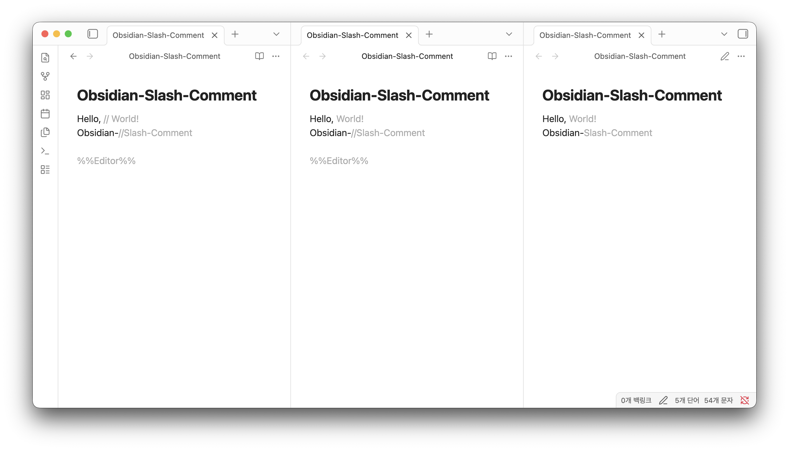

# Slash Comment for Obsidian

[](https://github.com/hyunsdev/obsidian-slash-comment/blob/master/manifest.json)
[](https://github.com/hyunsdev/obsidian-slash-comment/blob/master/LICENSE.md)
[](https://github.com/hyunsdev/obsidian-slash-comment)

This plugin adds support for Javascript-style comments (using the `//` syntax) to your notes in [Obsidian](https://obsidian.md). Any text following `//` on a line will be rendered with a comment style.



## Usage

Simply type `//` in the editor. Any text that follows on the same line will be styled as a comment. This is useful for adding notes, to-dos, or metadata to your documents that you want to be visually distinct from the main content.

```
This is a normal line of text.
// This is a comment. It will be styled differently.
You can also add comments after your text. // Like this.
```

## Installation

This plugin is not yet in the official Obsidian community plugin browser. It can be installed manually or using the [BRAT](https://github.com/TfTHacker/obsidian42-brat) plugin.

### With BRAT

1.  Install the **BRAT** plugin from the Obsidian Community Plugins browser.
2.  Open the settings for BRAT.
3.  Click on **"Add Beta plugin"**.
4.  In the repository field, enter: `hyunsdev/obsidian-slash-comment`
5.  Click **"Add Plugin"**. BRAT will install the latest version.
6.  Enable the **"Slash Comment"** plugin in the "Community plugins" tab in Obsidian's settings.

## Contributing

Contributions are welcome! If you have a suggestion for an improvement or have found a bug, please feel free to open an issue or create a pull request.

1.  Fork the repository.
2.  Create a new branch for your feature or bug fix (e.g., `git checkout -b feature/new-thing` or `bugfix/issue-fix`).
3.  Make your changes.
4.  Commit your changes (`git commit -m 'Add some feature'`).
5.  Push to the branch (`git push origin feature/new-thing`).
6.  Open a Pull Request.

## Acknowledgments

This plugin was inspired by and developed with reference to [obsidian-inline-spoilers](https://github.com/logonoff/obsidian-inline-spoilers).

## License

This plugin is licensed under the [GPL-3.0 License](LICENSE).
